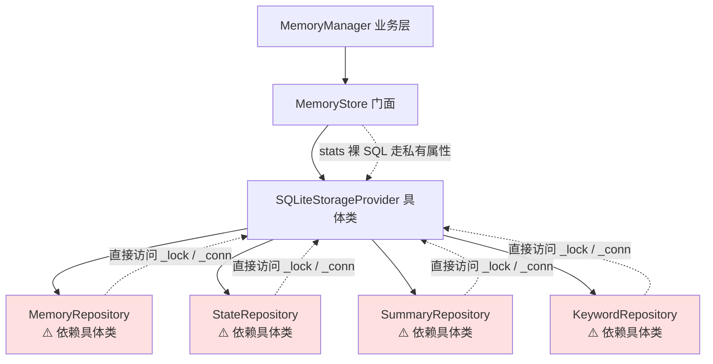
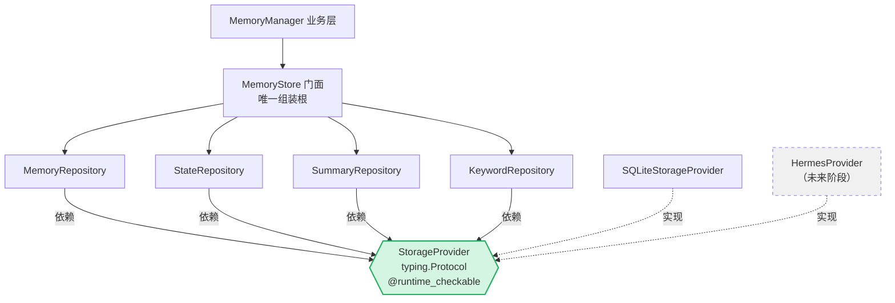
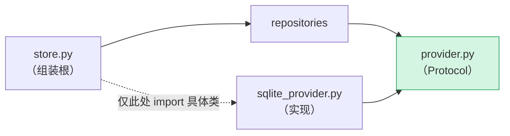

# Phase 1：MemoryStore 架构解耦 —— 交付报告

**日期**：2026-09-30
**项目**：Open-LLM-VTuber v1.2.x 二次开发（LTM 长期记忆子系统）
**服务器**：10.1.1.10 · `/home/uu/桌面/Open-LLM-VTuber`
**提交**：`1e6c3ef`（基线前 `928ebf9`）
**结论**：✅ 完成。目标分层建成，API 零变化，数据库零变化，上层零改动，全部测试通过。

---

## 1. 目标与达成情况

### 1.1 目标分层

```
MemoryManager  →  MemoryRepository  →  StorageProvider  →  SQLiteProvider
   (业务)            (数据访问)          (存储契约)         (SQLite 实现)
```

### 1.2 达成清单

| 要求 | 状态 | 证据 |
|---|---|---|
| 解除业务层 ↔ SQLite 强耦合 | ✅ | 4 个 repository 零 `_lock`/`_conn`/`sqlite3` 引用 |
| 建立显式 StorageProvider 契约 | ✅ | `storage/provider.py` 2 个 `@runtime_checkable` Protocol |
| 未来可插 HermesProvider | ✅ | repository 只依赖 Protocol，换实现零改动 |
| **本阶段不实现 Hermes** | ✅ | 无 Hermes 相关代码 |
| 禁止过度抽象 | ✅ | 无 AbstractRepository/BaseRepository/StorageFactory |
| MemoryManager 对外行为一致 | ✅ | 门面 21 方法签名零变化 + E2E 15/15 |
| 不改上层（Agent/Conversation/LLM/…） | ✅ | `git diff` 仅 8 文件，全在 `long_term_memory/` |
| 数据库兼容（禁删库/重建） | ✅ | schema 运行时逐字节对比一致；旧库直读通过 |
| MemoryStore 兼容层保留 | ✅ | facade 仍在，21 方法全委托 |

---

## 2. 架构图（重构前 → 重构后）

### 2.1 重构前（Phase 1A 状态）



**问题**：契约是隐式的 —— repository 类型标注写死 `SQLiteStorageProvider`，并通过 `_lock`/`_conn` 私有属性直接操作 sqlite3 对象。替换存储后端 = 改 4 个 repository。

### 2.2 重构后（Phase 1B 状态）



**改善**：契约显式化。repository 通过 5 个原语（`execute` / `query_one` / `query_rows` / `transaction` / `row_to_memory_record`）访问存储，不感知 SQLite。未来 `HermesProvider` 只需实现同一 Protocol。

### 2.3 依赖方向（单向）



`store.py` 是全项目**唯一** import `SQLiteStorageProvider` 具体类的地方（组装根），符合依赖倒置。

---

## 3. MemoryStore 全量公开方法职责清单

原始 406 行单体，业务/存储职责混杂。拆分后归属如下：

| # | 方法 | 当前职责 | 业务? | 存储? | 建议归属 |
|---|---|---|---|---|---|
| 1 | `__init__(conf_uid)` | 建连接、建表 | — | ✅ | 组装根 `store.py` |
| 2 | `conf_uid` (prop) | 委托 provider | — | ✅ | Provider → 门面转发 |
| 3 | `db_path` (prop) | 委托 provider | — | ✅ | Provider → 门面转发 |
| 4 | `add_memory` | INSERT OR REPLACE | — | ✅ | MemoryRepository |
| 5 | `update_memory` | 盖 `updated_at` + 写 | ✅ | ✅ | MemoryRepository（时间戳=域规则） |
| 6 | `get_memory` | 按 id 查 + 行映射 | — | ✅ | MemoryRepository |
| 7 | `list_memories` | 带 status/type 过滤查询 | — | ✅ | MemoryRepository |
| 8 | `list_all_memories` | 全量查询 | — | ✅ | MemoryRepository |
| 9 | `delete_memory` | 删 + 返回是否命中 | — | ✅ | MemoryRepository |
| 10 | `find_active_by_content` | 精确内容查找（去重用） | — | ✅ | MemoryRepository |
| 11 | `search_active` | **内存内 hits 评分排序** | ✅ | ✅ | MemoryRepository（域规则） |
| 12 | `mark_used` | 批量 `use_count+1`（事务） | — | ✅ | MemoryRepository（用 `transaction()`） |
| 13 | `count_memories` | 按 status 计数 | — | ✅ | MemoryRepository |
| 14 | `upsert_keyword` | 关键词 UPSERT（事务） | — | ✅ | KeywordRepository |
| 15 | `list_keywords` | 关键词列表 | — | ✅ | KeywordRepository |
| 16 | `delete_keyword` | 删关键词 | — | ✅ | KeywordRepository |
| 17 | `get_state` | 读 user_state | — | ✅ | StateRepository |
| 18 | `save_state` | 写 user_state | — | ✅ | StateRepository |
| 19 | `get_summary` | 读摘要 | — | ✅ | SummaryRepository |
| 20 | `save_summary` | 写摘要（含 turn_count） | — | ✅ | SummaryRepository |
| 21 | `get_turn_count` | 读轮次 | — | ✅ | SummaryRepository |
| 22 | `bump_turn_count` | 轮次 +1（事务） | — | ✅ | SummaryRepository |
| 23 | `stats` | 组合计数 | ✅ | ✅ | **门面组合**（原裸 SQL → 改委托） |
| 24 | `close` | 关连接 | — | ✅ | Provider → 门面转发 |

**唯一业务逻辑**：`search_active` 的内存评分、`update_memory` 的时间戳。其余皆为数据访问 —— 全部下沉到 repository。门面退化为**纯转发 + 组装**（143 行 vs 原 406 行）。

---

## 4. 改动清单（8 文件，全部在 `long_term_memory/` 内）

| 文件 | 类型 | 变化 | 说明 |
|---|---|---|---|
| `storage/provider.py` | **新增** | +129 | `StorageProvider` / `StorageTransaction` 两个 Protocol，纯 typing，仅 import `typing` + `contextlib` |
| `storage/sqlite_provider.py` | 修改 | +86/−? | 实现 5 个原语；新增 `_SQLiteTransaction`；DDL 逐字节不变 |
| `storage/memory_repository.py` | 修改 | 127 行变更 | 全部改走协议原语；移除 `_lock`/`_conn`/具体类名 |
| `storage/state_repository.py` | 修改 | 48 行变更 | 同上 |
| `storage/summary_repository.py` | 修改 | 52 行变更 | 同上 |
| `storage/keyword_repository.py` | 修改 | 46 行变更 | 同上 + 新增 `count_keywords()` |
| `storage/__init__.py` | 修改 | +20/−? | 导出两个 Protocol |
| `store.py` | 修改 | +23/−? | `stats()` 去裸 SQL 改组合委托；docstring 更新 |

**未改动**（证明上层零侵入）：`manager.py`、`retriever.py`、`extractor.py`、`deduplicator.py`、`privacy.py`、`schemas.py`、`prompt_builder.py`、`keyword_extractor.py`、`__init__.py`，以及 `agent/`、`conversations/`、`config/memory_panel.py` 等全部上层文件。

### 4.1 关键代码

**`storage/provider.py`** —— 契约（唯一新增文件）

```python
@runtime_checkable
class StorageProvider(Protocol):
    conf_uid: str
    db_path: str
    def execute(self, sql: str, params: Sequence[Any] = ()) -> int: ...
    def query_one(self, sql: str, params: Sequence[Any] = ()) -> Optional[Any]: ...
    def query_rows(self, sql: str, params: Sequence[Any] = ()) -> Sequence[Any]: ...
    def row_to_memory_record(self, row: Any) -> Any: ...
    def transaction(self) -> AbstractContextManager: ...
    def close(self) -> None: ...
```

**`store.py:stats()`** —— 从裸 SQL 改为纯组合

```python
# 前：直接走 provider._lock / provider._conn 执行裸 SQL
# 后：
def stats(self) -> Dict[str, Any]:
    return {
        "active_memories": self.memories.count_memories("active"),
        "deprecated_memories": self.memories.count_memories("deprecated"),
        "keywords": self.keywords.count_keywords(),
        "turn_count": self.get_turn_count(),
        "db_path": self.db_path,
    }
```

**`memory_repository.py:mark_used()`** —— 事务原语用法（原子性与旧 `with lock, conn:` 等价）

```python
def mark_used(self, memory_ids: List[str]) -> None:
    now = time.time()
    with self.provider.transaction() as tx:
        for mid in memory_ids:
            tx.execute(
                "UPDATE memories SET use_count=use_count+1, last_used_at=? WHERE memory_id=?",
                (now, mid),
            )
```

---

## 5. API 兼容性验证

### 5.1 门面签名零变化

`MemoryStore` 21 个公开方法 + `conf_uid` / `db_path` / `close()` 全部保持原签名与语义。已核实全部外部调用方（`manager.py` 15 处、`retriever.py` 3 处、`config/memory_panel.py` 17 处、`run_tests.py`）**只用门面公开方法**，无一触及 `provider` / `_lock` / `_conn`。

### 5.2 等价性测试

`equiv_1a.py` 用「旧 406 行单体」与「新分层实现」逐值对拍：

```
RESULT: 19/19 identical, 0 mismatches
```

### 5.3 接口验证

`verify_1a.py` 29 项断言：

```
RESULT: 29 passed, 0 failed
```

> **附带修正**：`verify_1a.py` 原有 3 处断言期望值写错（误认为 `save_summary` 不覆盖 `turn_count`）。经查原单体确认 `save_summary` = `INSERT OR REPLACE`（含 `turn_count`），是**原始语义**；用 git HEAD 版本跑同样 25 通过/3 失败，证明为 Phase-1A 遗留测试 bug 而非本阶段回归。已修正断言，重跑 29/29。

---

## 6. 数据库兼容性验证

| 验证项 | 方法 | 结果 |
|---|---|---|
| 对象集合一致 | 对比 `sqlite_master` 表+索引名 | ✅ 4 表 + 1 索引 |
| CREATE 语句一致 | 忽略大小写/空白逐字节对比 | ✅ 完全一致 |
| 列定义一致 | `PRAGMA table_info` name/type/notnull/pk | ✅ 完全一致 |
| 旧库可直读 | 用重构前实现创建的 `.db` 新代码直读 | ✅ 通过 |
| 未删库/未重建 | 现网 `mao_pro_001.db` 全程复用 | ✅ 无迁移脚本 |

DDL 逐字节保留在 `SQLiteStorageProvider._init_tables()`，未做任何改动。

**现网真实数据核对**（E2E 结束后）：

```
active 13 | deprecated 1 | keywords 19 | turn_count 9
db_path = /home/uu/桌面/Open-LLM-VTuber/long_term_memory_data/mao_pro_001.db
```

`stats()` 组合委托结果与历史裸 SQL 结果完全一致（smoke 测试含专项对比）。

---

## 7. 测试结果汇总

| # | 测试 | 范围 | 结果 |
|---|---|---|---|
| 1 | `run_tests.py` | 单元测试（全模块） | ✅ **41 passed, 0 failed** |
| 2 | `equiv_1a.py` | 新旧实现逐值对拍 | ✅ **19/19 identical, 0 mismatches** |
| 3 | `verify_1a.py` | 分层接口断言 | ✅ **29 passed, 0 failed** |
| 4 | `tools/ltm_phase1b_smoke.py` | 本地冒烟（10 组） | ✅ **86 passed, 0 failed** |
| 5 | `tools/ltm_e2e.py` | **真实 LLM 端到端** | ✅ **15 passed, 0 failed** |

### 7.1 冒烟测试覆盖（#4，10 组）

| 组 | 内容 |
|---|---|
| 1 | 协议一致性（`isinstance` vs `runtime_checkable`） |
| 2 | 门面 21 方法端到端 |
| 3 | repository 直连裸 provider（不经过门面） |
| 4 | 旧 schema DB 兼容 |
| 5 | 并发（6 线程 × 25 次读写） |
| 6 | 异常路径（事务回滚 / provider 已关闭） |
| 7 | `stats()` vs 裸 SQL 计数对比 |
| 8 | `execute` rowcount / miss 返回 None / 空结果 |
| 9 | **架构契约静态检查**（源码级） |
| 10 | **运行时 schema 身份对比**（vs Phase-0 单体） |

**第 9 组静态契约检查明细**（全部 OK）：

- 4 个 repository 源码中无 `_lock` / `_conn` / `sqlite3` 私有/具体访问
- 门面无私有访问、无裸 SQL
- 门面是**唯一**命名具体 provider 的组装根
- `provider.py` 无 `sqlite3` import，仅依赖 `typing` + `contextlib`
- 两个 Protocol 均已声明且 `runtime_checkable`
- 无禁用抽象类（`AbstractRepository` / `BaseRepository` / `GenericRepository` / `StorageFactory`）

### 7.2 E2E 端到端（#5，真实 WebSocket + 真实 LLM）

| 场景 | 断言 | 结果 |
|---|---|---|
| — | connected & got conf_uid | ✅ |
| — | history session created | ✅ |
| A | 火锅 memory stored / retrieval hit（`use_count=1`） | ✅ ✅ |
| B | 小白 memory stored | ✅ |
| C | 旧咖啡 deprecated / 保留 history / 新版本 active | ✅ ✅ ✅ |
| D | `Python→technology` / `网络安全→skill` / `实习→goal` | ✅ ✅ ✅ |
| E | 下雨 不产生长期记忆 | ✅ |
| F | 小雪 存储 / relationship-or-identity 类型 / 无关键词也能召回 | ✅ ✅ ✅ |

```
E2E RESULT: 15 passed, 0 failed
```

---

## 8. 调用链核查与结论

### 8.1 调用链核查

| 调用方 | 位置 | 使用方式 | 受影响 |
|---|---|---|---|
| `MemoryManager` | `manager.py` | 仅门面公开方法 | ❌ 无 |
| `Retriever` | `retriever.py` | 仅门面公开方法 | ❌ 无 |
| 管理面板 | `config/memory_panel.py` | 仅门面公开方法 | ❌ 无 |
| Agent 层 | `agent/agents/basic_memory_agent.py` | 消费 `metadata["ltm_context"]` | ❌ 无 |
| Conversation 层 | `conversations/single_conversation.py` | 调 `get_manager` / `extract_from_turn` | ❌ 无 |

**无任何上层代码触及 SQLite** —— 泄漏面（`_lock`/`_conn`）原仅存在于 `store.py:stats()` 与 4 个 repository 内部，现已全部收敛至 `SQLiteStorageProvider` 私有。上层只经门面/Manager，因此 API 天然兼容。

### 8.2 强制停止条件核查（§十九）

| 停止条件 | 是否触发 |
|---|---|
| 需要修改 Agent / Conversation 大量代码 | ❌ 未触发（零改动） |
| 需要迁移数据库 | ❌ 未触发（DDL 零变化） |
| 需要修改对外 API | ❌ 未触发（签名零变化） |

**结论**：本阶段在允许范围内完整落地，未触碰任何停止条件。

### 8.3 遗留与后续

| 项 | 说明 |
|---|---|
| HermesProvider | 本阶段**未实现**（按约束）。契约已就绪，未来实现该 Protocol 即可，无需改动 repository |
| `retriever.py` 直连门面 | 仍经 `MemoryStore` 门面（兼容层），符合 §十二「旧接口保留」 |
| 新代码约定 | 新增功能优先直用 `MemoryRepository`，不再新增 SQLite 依赖 |
| `src_ltm_phase0_backup/` | Phase 0 全量备份保留，供等价性测试使用 |

### 8.4 交付物

| 路径 | 说明 |
|---|---|
| 服务器 `1e6c3ef` | 8 文件，+366/−165 |
| 本地 `src_ltm/` | 权威编辑基线（与服务器 MD5 逐项一致） |
| `tools/ltm_phase1b_smoke.py` | 本地冒烟测试（86 项，可复用） |
| `src_ltm_phase0_backup/` | Phase 0 备份 |

---

## 附：验证命令（复现用）

```bash
# 单元测试
cd /home/uu/桌面/Open-LLM-VTuber/src/open_llm_vtuber/long_term_memory
/root/.local/bin/uv run python run_tests.py

# 等价 + 接口验证
cd /home/uu/桌面/Open-LLM-VTuber
/root/.local/bin/uv run python /tmp/equiv_1a.py
/root/.local/bin/uv run python /tmp/verify_1a.py

# 端到端（真实 LLM，约 4 分钟）
/root/.local/bin/uv run python /tmp/ltm_e2e.py

# 本地冒烟（Windows）
./sshagent/Scripts/python.exe tools/ltm_phase1b_smoke.py
```

---

**报告人**：WorkBuddy（AI）
**状态**：✅ Phase 1 完成，已提交 `1e6c3ef`
